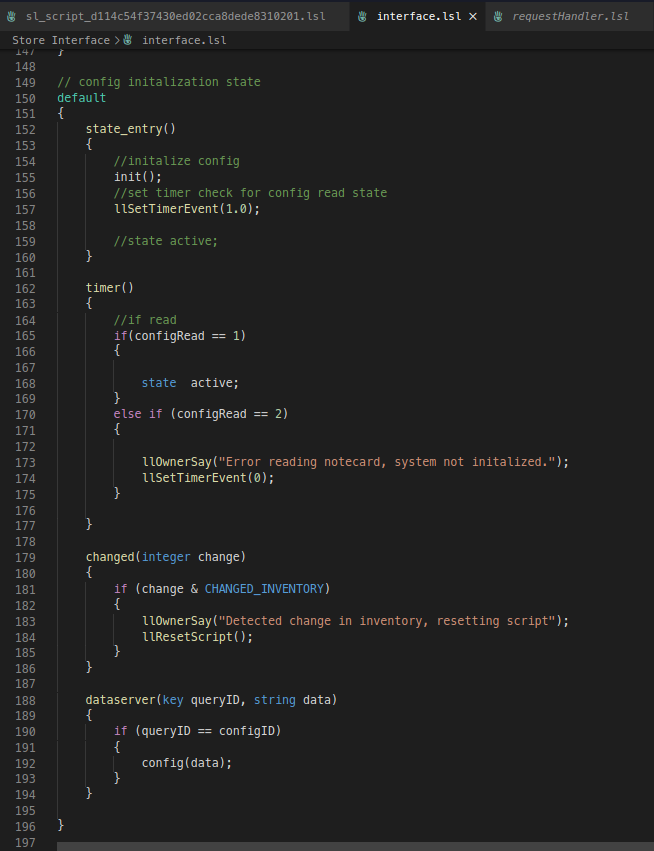

# LSL-FS README

Provides basic snippets and syntax for LSL and Firestorm enabled features.

## Features

Makes use of [Makopo's Sublime Syntax](https://github.com/Makopo/sublime-text-lsl) converted for use in VSCode.

Updates and reworks snippets used in [LSL-FP](https://marketplace.visualstudio.com/itemdetails?itemName=DalGhost.lsl-fp).

## Release Notes

Initial release.

## Future plans

- Add syntax highlighting for Firestorm Preprocessor directives.

## Patch Notes

### 0.1.8
* Update LSL version to 2023-11-07.6790647783.
* Adds LSL support for upcoming PBR materials project.
* Fixed issue where an erroneous list of constants was being provided for llSetEnvironment.

### 0.1.7
* Update LSL version to 2023-06-09.580543.
* Cleaned up unnecessary whitespace in some snippets.

### 0.1.6
* Update LSL version to 2023-03-24.579022.
* Deprecation warning in descriptions only since we have 'avoid' highlighting.

### 0.1.5
* Fix snippet tab completion.
* Update LSL version to 2023-01-11.577595.
* Fill in missing snippets for new (and not new) functions and constants.
* Update deprecation and restricted use warnings.

### 0.1.0

* Basic syntax converted from [Makopo's Sublime Syntax](https://github.com/Makopo/sublime-text-lsl)
* Updates snippets from [LSL-FP](https://marketplace.visualstudio.com/itemdetails?itemName=DalGhost.lsl-fp)
* Reworks snippets from [LSL-FP](https://marketplace.visualstudio.com/itemdetails?itemName=DalGhost.lsl-fp)
